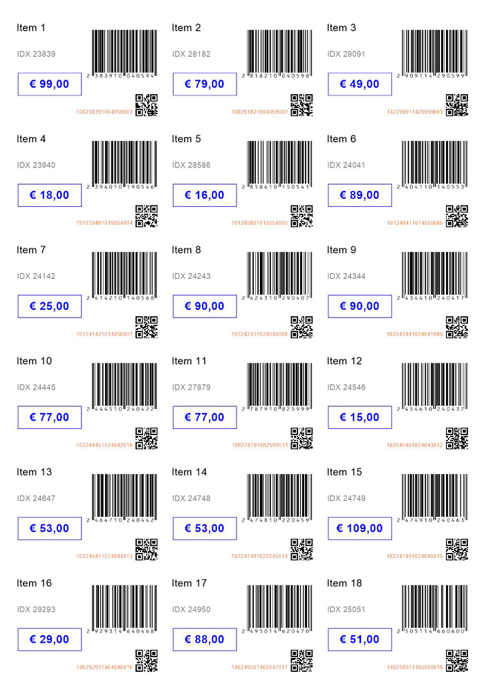
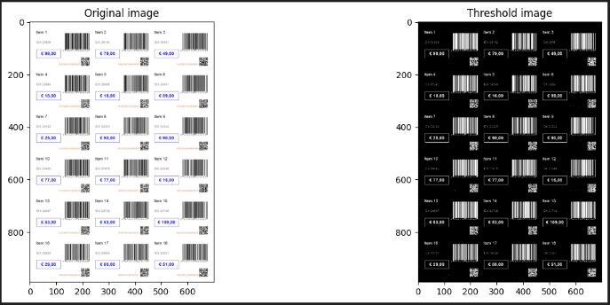
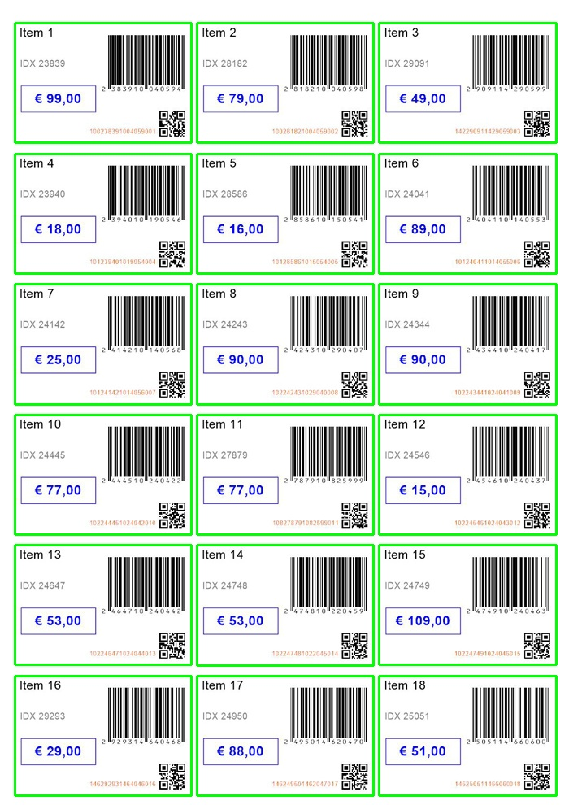

# Image Processing/image Extraction Project

This project performs image processing to detect and extract significant contours from a given image. The process involves applying thresholding, morphological operations, and contour filtering. Extracted objects are saved as separate images for further analysis.

## Features
- Displays the **original image**.
- Displays the **thresholded image**.
- Shows the **original image with bounding boxes** around detected contours.
- Saves and displays all **extracted images** of significant contours.

## Installation
To run this project, you need to install the following dependencies:

```bash
pip install opencv-python numpy matplotlib
```
## Usage
1. Place the input image in the `inputimage` directory.
2. Run the script using the following command:
3. The results will be displayed step-by-step, and extracted images will be saved to the `Output_Cropped_Tags/` directory.
4. Scriptfile - CV_PriceTag_Extraction.ipynb


## Directory Structure
```
project/
├── inputimage/
│   └── PriceTag.jpg
├── intermidiate_images/
│   └── Thresholdedimage.png
|   └── orig_image_with_bounding_box.jpg
├── Output_Cropped_Tags/
│   ├── tag_1.jpg
├── CV_PriceTag_Extraction.ipynb
```

## Workflow

## 1. Loading Original Image
### The original image is loaded and displayed for reference:
```python
import cv2
import matplotlib.pyplot as plt
image = cv2.imread('input_image.jpg')
plt.imshow(cv2.cvtColor(image, cv2.COLOR_BGR2RGB))
plt.title("Original Image")
plt.show() 
```

## 2. Thresholded Image
### The image is converted to grayscale and thresholded to highlight objects of interest:
```python
gray = cv2.cvtColor(image, cv2.COLOR_BGR2GRAY)
_, thresh = cv2.threshold(gray, 127, 255, cv2.THRESH_BINARY)

plt.imshow(thresh, cmap='gray')
plt.title("Thresholded Image")
plt.show()
```


## 3. Morphological Closing
### A morphological closing operation is applied to fill small gaps:
```python
kernel = cv2.getStructuringElement(cv2.MORPH_RECT, (15, 15))
closed = cv2.morphologyEx(thresh, cv2.MORPH_CLOSE, kernel)
```
## 4. Contour Detection and Filtering
### Contours are detected and filtered based on area:
```python
contours, _ = cv2.findContours(closed, cv2.RETR_EXTERNAL, cv2.CHAIN_APPROX_SIMPLE)
filtered_contours = [ctr for ctr in contours if cv2.contourArea(ctr) > 3000]
```
## 5. Display Original Image with Bounding Boxes
### Bounding boxes are drawn around significant contours:
```python
for ctr in filtered_contours:
    x, y, w, h = cv2.boundingRect(ctr)
    cv2.rectangle(image, (x, y), (x + w, y + h), (0, 255, 0), 2)
plt.imshow(cv2.cvtColor(image, cv2.COLOR_BGR2RGB))
plt.title("Original Image with Bounding Boxes")
plt.show()
```

## 6. Extract and Save Contour Regions
### Each contour region is cropped and saved as a separate image:
```python
import os
output_folder = "Output_Cropped_Tags/"
os.makedirs(output_folder, exist_ok=True)

for idx, (x, y, w, h) in enumerate(all_tags):
    tag_crop = image[y:y + h, x:x + w]
    output_path = f"{output_folder}/tag_{idx + 1}.jpg"
    cv2.imwrite(output_path, tag_crop)
    print(f"Saved: {output_path}")
    plt.imshow(cv2.cvtColor(tag_crop, cv2.COLOR_BGR2RGB))
    plt.title(f"Extracted Image {idx + 1}")
    plt.show()
```
- **Extracted Tag 1**:
  

## Notes
- The **area threshold (3000 pixels)** can be adjusted based on the size of objects of interest.
- Ensure the input image has clear contrast for better results.
